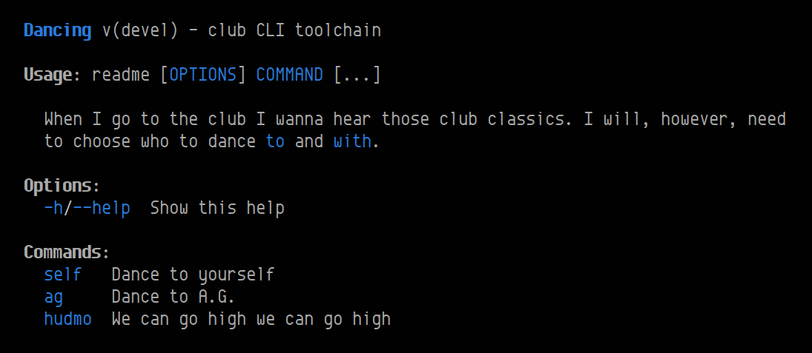

# c~~har~~li

[](https://pkg.go.dev/github.com/starriver/charli)
[](https://goreportcard.com/report/github.com/starriver/charli)
[](https://youtu.be/bLJ-zfBmChA)
[](https://coveralls.io/github/starriver/charli?branch=main)

A small CLI toolkit. It includes a **CLI parser**, **help formatter**, and **completer** for bash & fish.



[See the code](./examples/readme/) for the above screenshot.

## Quickstart

To install:

```sh
go get github.com/starriver/charli
```

- [See the guide](./docs/guide.md) for usage instructions.
- [Examples](./examples)
- [Reference](https://pkg.go.dev/github.com/starriver/charli)

## Who's this for?

Use charli if you want to:

- **Configure your CLI with struct data.** It doesn't use the builder pattern, struct tags or reflection.
- **Have complete control over your app's I/O**. Expect no magic or surprises! None of the core functions have any side-effects.
- **Bring your own input validation.** The parser outputs a map of options & positional args according to your config. It aggregates errors caused by unknown args and bad syntax. Nothing else is transformed: values are strings, flags are bools.

## Design

We made charli because we're very picky about how we want our CLIs to look and behave – in particular, we want to engineer complex, imperative flows for validation. The amount of hacking required on other libraries wasn't worth it for us, so we made this instead.

### Comparisons

- [urfave/cli](https://github.com/urfave/cli) is a great library. Before using charli, try this. It's far more beginner-friendly, yet is probably this library's closest relative. Like charli, it features procedural operation and is configured via struct data – yet provides far more functionality out of the box.
- [mitchellh/cli](https://github.com/mitchellh/cli) (now archived) also provides a nice degree of control with a procedural style, but instead provides flexibility through its interface types and factories (which you won't find here).

### Parser syntax

#### Options

charli supports both short and (GNU-style) long options.

Options normally take a string value. **Flags** are options without a value – ie. they have a boolean output.

Provided that `-o/--option` and `-f/--flag` are configured, all of these are valid:

```sh
program --option value
program --option=value
program -o value
program --flag
program -f
```

If a value starts with `-`, usage of the `--option=value` format is required to prevent ambiguity:

```sh
program --option -f    # Error!
program --option=-f    # Valid
```

Additionally, combined short flags are supported, but *not* combined short options. If `-j` and `-k` are also configured as flags:

```sh
program -fjk           # Valid
program -fjko value    # Error!
program -fjk -o value  # Valid
```

#### Positional arguments

Any number of positional arguments can be configured. Args can be mixed in with options, and `--` can be used to stop parsing options.

Let's say 2 args are configured:

```sh
program a b                 # Valid: []string{"a", "b"}
program a -- -b             # Valid: []string{"a", "-b"}
program a --option value b  # Valid: []string{"a", "b"}
program --option a b        # Error! ('a' is the value for --option)
program a b c               # Error! (too many args)
```

Regarding the last line above, varadic args are also supported. If enabled, it would become valid.

#### Commands

In all of the above examples, the program has only had a single command. Instead, we can add multiple named commands, which should be supplied as the first argument.

Options can be global or command-specific. Positional arguments are always command-specific.

With `pull` and `push` commands configured, all of these are valid:

```sh
program pull
program push
program pull --option value
program push -f
```

A default command can also be configured, allowing the first argument to be omitted. Note that this introduces some ambiguity should the first argument not be an option (ie. not starting with `-`).

#### Requesting help

By default, the special `-h/--help` options can be used to request help – either for the whole program or a single command.

This flag can be supplied anywhere on the command line, but the parser will *suggest* that only certain forms exit with an OK status (it's up to you how to react to this suggestion, though).

```sh
program -h              # OK - display global help
program -h pull         # OK - display help for pull
program pull -h         # OK - display help for pull
program pull --flag -h  # Error - display help for pull anyway
program                 # Error - display global help anyway
```

`help` can also be optionally enabled as a pseudo-command, which will make all of these valid:

```sh
program help
program help pull
program pull help
```

### Goals

- **Provide only necessary validation.**
	- Syntax checking only.
	- No transformation for values – only strings (and bools, in the case of flags).
	- This is to provide full control over the validation process downstream.
- **Produce as many errors as possible.**
	- Aggregate errors. Downstream can decide how to deal with them.
	- Don't give up after encountering one parse error. Keep going!
	- Allow downstream validations to continue even with parse errors.
	- However: make downstream validations aware of previous errors, so that expensive operations can be short-circuited.
- **Render a relatively sane help format.**
	- Allow arbitrary highlighting using a set color.
	- Prefer using raw strings for long description blocks [(example)](./examples/options/main.go).
	- Make color optional. We use [fatih/color](https://github.com/fatih/color), which allows turning them off (and automatically disables them when not in a tty).
	- More than anything else, we just made it look the way we wanted it to.
- **Idiomatic Go.**
	- Leverage the flexibility of structs and zero values.
	- Aim for a procedural style.
	- `io.Writer` galore.

## License

[](./LICENSE)
